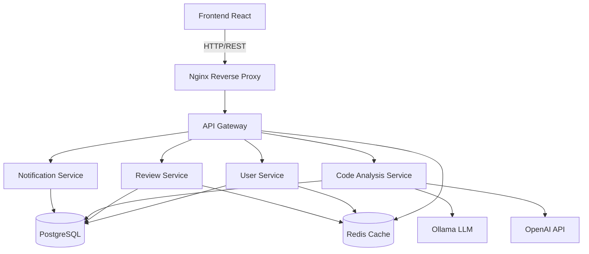

# 📚 Documentation Technique - AI Code Review Assistant

## 🏗️ Architecture Générale

### Vue d'ensemble

L'AI Code Review Assistant est une application distribuée basée sur une architecture microservices, conçue pour analyser automatiquement le code source et fournir des recommandations intelligentes.

### Composants Principaux



## 📊 Base de Données

### Schéma Principal

#### Table `users`

```sql
- id (UUID, PK)
- email (VARCHAR, UNIQUE)
- username (VARCHAR, UNIQUE)
- password_hash (VARCHAR)
- role (ENUM: user, admin, moderator)
- created_at, updated_at (TIMESTAMP)
```

#### Table `code_reviews`

```sql
- id (UUID, PK)
- user_id (UUID, FK)
- project_id (UUID, FK)
- file_name (VARCHAR)
- file_content (TEXT)
- file_language (VARCHAR)
- status (ENUM: pending, processing, completed, failed)
- processing_time_ms (INTEGER)
```

#### Table `analysis_results`

```sql
- id (UUID, PK)
- review_id (UUID, FK)
- analysis_type (ENUM: bugs, optimizations, security, style, tests)
- severity (ENUM: critical, high, medium, low, info)
- title, description (TEXT)
- line_number, column_number (INTEGER)
- suggested_fix (TEXT)
- confidence_score (DECIMAL)
```

## 🔧 Services Détaillés

### API Gateway (Port 5000)

**Responsabilité**: Point d'entrée unique, routage, authentification, rate limiting

**Technologies**: Node.js, Express, JWT

**Endpoints principaux**:

- `POST /auth/login` - Authentification
- `POST /auth/register` - Inscription
- `POST /api/reviews` - Soumettre du code pour analyse
- `GET /api/reviews/:id` - Récupérer les résultats
- `WebSocket /ws` - Notifications temps réel

### User Service (Port 5001)

**Responsabilité**: Gestion des utilisateurs, authentification, profils

**Technologies**: Node.js, Express, bcrypt, JWT

**Fonctionnalités**:

- Inscription/Connexion sécurisée
- Gestion des profils utilisateur
- Tokens d'API
- Métriques utilisateur

### Review Service (Port 5002)

**Responsabilité**: Orchestration des analyses de code, gestion des résultats

**Technologies**: Node.js, Express, Multer (upload)

**Fonctionnalités**:

- Upload et validation de fichiers
- Orchestration des analyses
- Stockage des résultats
- Historique des reviews

### Code Analysis Service (Port 5003)

**Responsabilité**: Analyse intelligente du code avec IA

**Technologies**: Python, FastAPI, Ollama, OpenAI, AST

**Fonctionnalités**:

- Analyse syntaxique (AST)
- Détection de bugs
- Optimisations de performance
- Génération de tests unitaires
- Suggestions de corrections
- Support multi-langages

### Notification Service (Port 5004)

**Responsabilité**: Notifications et alertes

**Technologies**: Node.js, Express, WebSocket

**Fonctionnalités**:

- Notifications en temps réel
- Email notifications
- Webhooks
- Alertes système

## 🤖 Intelligence Artificielle

### Modèles Utilisés

#### Ollama (Gratuit, Local)

- **CodeLlama 7B**: Analyse de code, optimisations
- **Llama 2 7B**: Explications et documentation
- **Phi-2**: Tests unitaires et corrections rapides

#### OpenAI (Quota Gratuit)

- **GPT-3.5-turbo**: Analyses complexes et suggestions
- **GPT-4** (optionnel): Analyses avancées

### Pipeline d'Analyse

1. **Préprocessing**

   - Validation syntaxique
   - Détection du langage
   - Extraction des métadonnées

2. **Analyse Statique**

   - AST parsing
   - Détection de patterns
   - Métriques de complexité

3. **Analyse IA**

   - Détection de bugs potentiels
   - Suggestions d'optimisation
   - Génération de tests
   - Amélioration du style

4. **Post-processing**
   - Scoring de confiance
   - Priorisation des suggestions
   - Formatage des résultats

## 🔐 Sécurité

### Authentification

- JWT tokens avec expiration
- Refresh token rotation
- Password hashing (bcrypt, 12 rounds)

### Autorisation

- Role-based access control (RBAC)
- API tokens avec permissions granulaires
- Rate limiting par utilisateur

### Validation

- Input sanitization
- File type validation
- Size limits (10MB max)
- SQL injection protection

### HTTPS/TLS

- TLS 1.2+ uniquement
- Perfect Forward Secrecy
- HSTS headers

## 📈 Monitoring & Logs

### Métriques

- Request/response times
- Error rates par service
- Usage patterns
- Resource utilization

### Logs Structurés

```json
{
  "timestamp": "2024-01-15T10:30:00Z",
  "service": "code-analysis",
  "level": "info",
  "user_id": "uuid-here",
  "action": "analyze_code",
  "file_language": "javascript",
  "processing_time_ms": 1250,
  "model_used": "codellama:7b"
}
```

## 🚀 Déploiement

### Environnements

#### Développement

```bash
docker-compose -f docker-compose.dev.yml up
```

- Hot reload activé
- Logs détaillés
- Base de données de test

#### Production

```bash
docker-compose up -d
```

- Build optimisé
- SSL/TLS activé
- Monitoring complet

### Scaling

- Load balancing automatique
- Auto-scaling des containers
- Base de données répliquée
- Cache distribué

## 🧪 Tests

### Types de Tests

- **Unit Tests**: Jest (Node.js), Pytest (Python)
- **Integration Tests**: API endpoints
- **E2E Tests**: Playwright
- **Performance Tests**: Artillery.js

### Coverage

- Minimum 80% code coverage
- Tests automatiques sur PR
- Tests de régression

## 📊 Performance

### Objectifs

- **Response Time**: < 200ms (95th percentile)
- **Analysis Time**: < 30s pour fichiers < 1MB
- **Availability**: 99.9% uptime
- **Throughput**: 1000+ analyses/hour

### Optimisations

- Redis caching
- Database indexing
- CDN pour assets
- Gzip compression
- Keep-alive connections

## 🔄 CI/CD

### Pipeline GitHub Actions

1. **Tests**: Unit, Integration, E2E
2. **Security**: SAST, dependency scanning
3. **Build**: Docker images
4. **Deploy**: Staging → Production
5. **Monitor**: Health checks post-deploy
